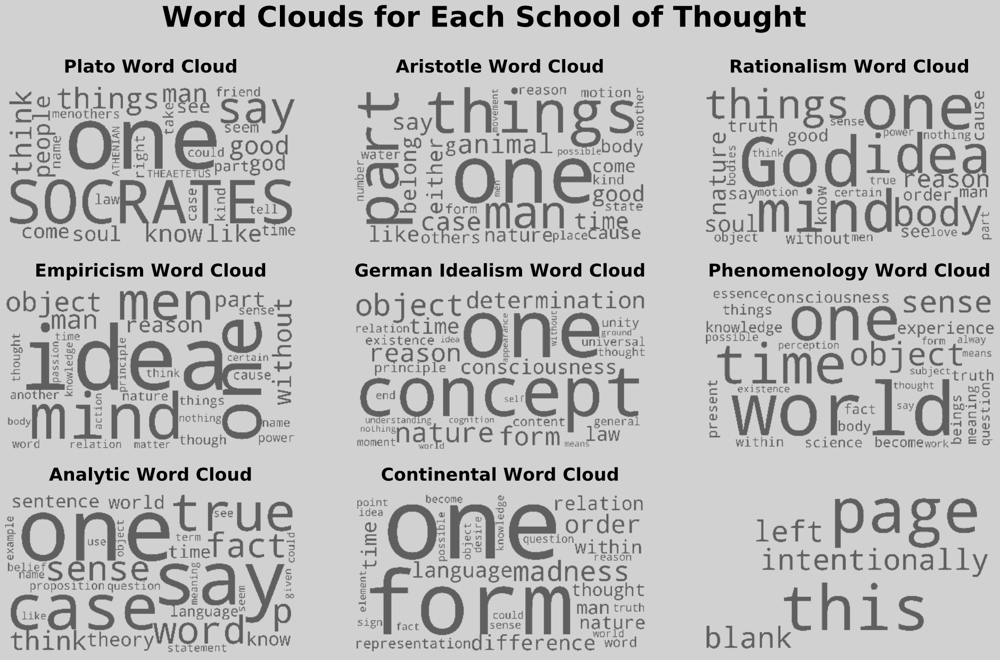
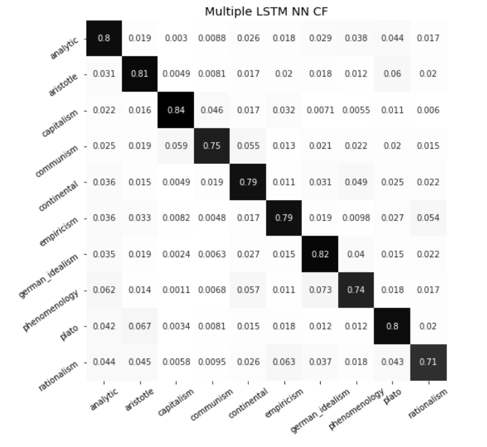
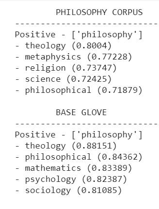

# Philosophy NLP & Text Classification
A book of philosophy represents an effort to systematically organize one's thought about the world. Using the data from the history of philosophy to classify texts thus enable us to, by proxy, classify how people think about the world. Where some projects focus on sentiment analysis, here we focus on conceptual, or ideological analysis. 

This project uses 51 texts spanning 10 schools of philosophical thought. Based on these, we develop classification models, word vectors, and general EDA. This can then be used to understand user's worldviews by comparing them to historical schools of thought. And once we understand a person's worldview, there is no limit to what we can do with that information - from advertising to political campaigning through to self-exploration and therapy. 

#### Repo Contents
- a [data_load_clean notebook](https://github.com/kcalizadeh/phil_nlp/blob/master/Notebooks/1_data_load_clean.ipynb) containing preliminary EDA and our work on cleaning the data
- a [non_neural_model notebook](https://github.com/kcalizadeh/phil_nlp/blob/master/Notebooks/2_non-neural_models.ipynb) containing non-neural-network models (primarily Naive Bayesian models)
- a [w2v notebook](https://github.com/kcalizadeh/phil_nlp/blob/master/Notebooks/3_w2v.ipynb) where we develop w2v analyses for each school and author
- a [neural_networks notebook](https://github.com/kcalizadeh/phil_nlp/blob/master/Notebooks/4_neural_networks.ipynb) containing work on neural network models and deep NLP
- a [functions.py file](https://github.com/kcalizadeh/phil_nlp/blob/master/Notebooks/functions.py) with useful NLP functions we use throughout
- a [bibliography notebook](https://github.com/kcalizadeh/phil_nlp/blob/master/Notebooks/5_bibliography.ipynb) citing all the relevant texts

Throughout the project, we implemented the OSEMN procedure for data science

### Obtaining the data
Our data came from two primary sources: Project Gutenberg and our own collection of pdfs. These pdfs were transformed into txt files for easier processing. Overall, we had 51 books, 31 authors, and 10 schools of philosophy in our dataset. 

### Scrubbing the data
Working with books is hard! There were any number of textual irregularities, repetitive but meaningless phrases, and other oddities we had to correct for. This was especially true of the texts that came from pdfs, as many times headers, page numbers, or footnotes would be included in the main body, often interrupting sentences. To clean this up, we did extensive cleaning in our cleaning notebook. This included:
- removing roman numerals and odd characters 
- removing sentences that were too short to have real meaning
- removing sentences in non-English languages
- consolidating different characters to one and the same (making sure '&' was 'and', for example)
- building an extensive dictionary of textual corruptions and their corrected forms for ad hoc correction

### Exploring the data
We explored the data in our preliminary EDA steps. There, we generated word frequency tables, bigram frequency tables, and word clouds. The word clouds, for example, are here:

Our w2v work also helped explore the data as it brought to light a lot of oddities in the texts (odd words correlated with normal ones) and helped us see how words were used in the corpus. 

In the course of our work on the dash app, we developed visualization functions that could generate basic textual statistics for every school, author, and title in the corpus. 

### Modeling the data
Our work on modeling took two primary forms - Bayesian models and deep NLP. Overall our aim was to maximize accuracy. We were able to attain 77% accuracy with Bayesian models and just shy of 80% accuracy with neural networks utilizing LSTM. A confusion matrix is presented below. 

Our w2v models, based on pre-trained GloVe vectors and then trained on our corpus, were able to create meaningful and illuminating vectors for each school and for the corpus as a whole. Below, for example, is a comparison of the base GloVe vector's interpretation of 'philosophy', as compared to the trained model's interpretation of the same.

Note that 'metaphysics' is a term used by non-philosophers to describe things like astrology and spiritualism. Philosophers, however, use it in a more specific way where it becomes a key concept of the discipline. Thus our trained vectors identify metaphysics and philosophy where the base GloVe model does not.

### Interpreting the data
What does all this mean? Well, for one thing, it means that given any specific body of text (the larger the better) we can correctly identify the philosophical leanings of the author 80% of the time. This means that we can tell whether they value reason (analytic philosophy) or think it is forever limited (continental philosophy), whether they prefer their senses (empiricism) or conceptual analysis (rationalism), or whether they are left-leaning economically (communism) or right-leaning (capitalism). 

With this knowledge, we can then make sure to speak to our audiences in the ways that they will understand and identify with. Don't produce detailed logical arguments for people who value their gut instincts, don't go on and on about conceptual definitions when your clients want to hear the facts and figures. 

The model can be used to identify the philosophical leanings of potential clients, customers, or employees (in the classification phase) and to better understand those leanings (in the exploration phase, via w2v analysis). This can facilitate more productive conversations, better customer relations, and stronger employee productivity.

### Conclusion & Next Steps
Overall, we were able to attain about 80% accuracy over 10 classes - a solid result. Our w2v models gave clear pictures of their respective schools, though they were less helpful at the level of authors since they had less text to go on there. The data was visualized and made available for use in classification and exploration on a dash app. The repo for that app is [here](https://github.com/kcalizadeh/phil_nlp_dashboard).

The solid accuracy scores and wide-open potential applications of the model made the project seem like a promising one for further development. Our next steps include:
- working with the Twitter API to build a function that can take a Twitter user's handle and generate a classification for that user.
- adding additional texts to the corpus, especially those associated with Stoicism, eastern philosophy (Confucianism, Taoism, Buddhism), and contemporary political movements. 
- building a recommender system to recommend books or other media based on a user's philosophical leanings.

Thank you for your interest. If you are interested in contributing to the project or have questions about it, please feel free to email me at kcalizadeh@gmail.com or to reach out on Twitter - @aslidsiksoraksi.